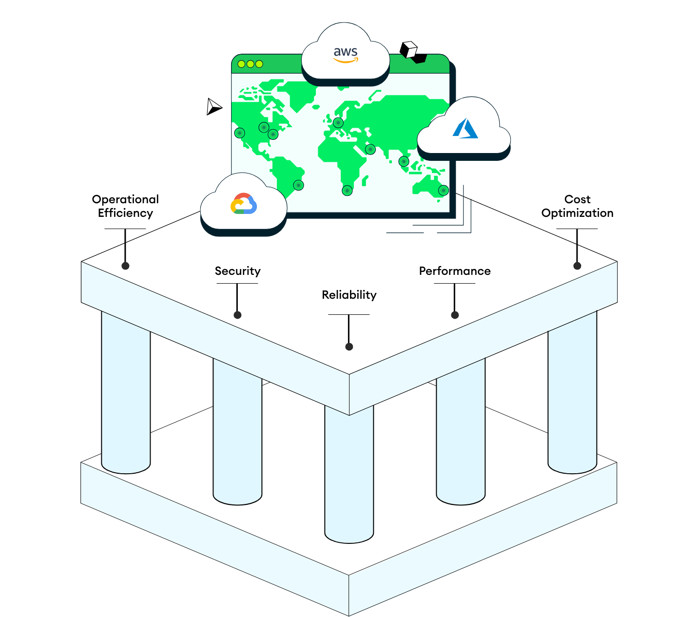

The Atlas Architecture Center's content aligns with the Atlas Well-Architected Framework pillars:

Operational Efficiency: Automation, monitoring, and observability that enhance efficiency.

Security: Network settings, access control, and more to safeguard data integrity and privacy.

Reliability: High availability, backups, and more to minimize downtime and prevent data loss.

Performance: Built-in vertical and horizontal scaling to meet increased demand without over-provisioning.

Cost Optimization: Visibility and cost management while maintaining performance.

Operational Efficiency
   Atlas Atlas Well-Architected Framework includes features that support your organization's operations with minimum expenditure of time and effort, including tools for automation and monitoring and alert tools and integrations.
    Automated Infrastructure Provisioning

You can automate the management, provisioning, and configuration of Atlas building blocks like database users and roles, Atlas clusters, projects and organizations. Additionally, you can automate setting up and managing additional clusters resources, including enabling auto-scaling compute and storage, creating and updating multi-cloud clusters, monitoring cluster performance and health, automating backups and restores, defining backup policies, and many more.

You can align your choice of tools with your preferred workflow to ensure seamless integration of MongoDB Atlas into your existing processes. The following MongoDB Atlas tools allow you to easily deploy and manage Atlas at scale with repeatable, accurate, and scalable processes.

Atlas Administration API
Atlas Administration API
The Atlas Administration API provides a RESTful interface that allows you to leverage your preferred client such as cURL or Postman to directly interact with API endpoints that correspond to Atlas resources. They can also be directly called in your favorite programming language or bash script.
HashiCorp Terraform MongoDB Atlas Provider
Provisions Atlas resources across cloud providers (AWS, Azure, GCP) in the workflow of your choice. It allows you to integrate Atlas into your continuous delivery workflows with the official plugin.

Alternatively, you can use the CDKTF to deploy Atlas in preferred languages such as JavaScript, TypeScript, Python, Java, C#, and Go.